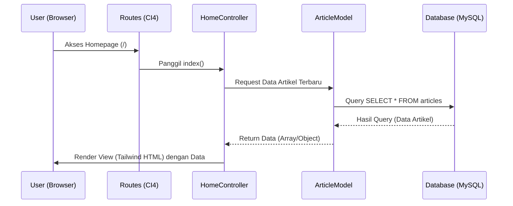
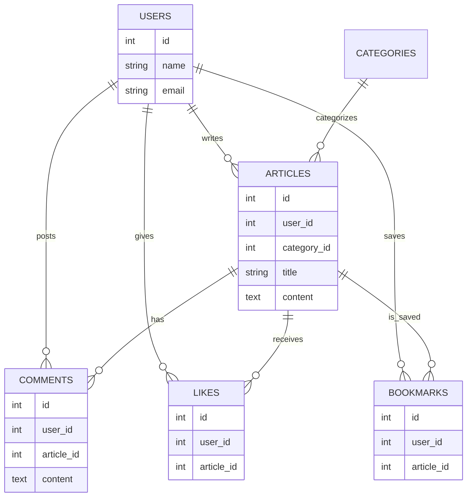

# PRD — Project Requirements Document

## 1. Overview

**Nama Proyek:** Nerita App

Nerita adalah platform publikasi digital minimalis berbasis gratis (_Free-to-use_) bagi para kreator untuk menulis dan membagikan artikel. Target pembaca utama aplikasi ini adalah para **Pencari Artikel** yang menginginkan informasi berkualitas dalam balutan UI yang bersih. Aplikasi ini dirancang untuk menyelesaikan masalah pengalaman membaca yang penuh distraksi dan antarmuka penulisan yang rumit pada platform publikasi konvensional, dengan menawarkan pengalaman yang mulus, editor teks yang kaya fitur, serta ekosistem interaksi pembaca yang interaktif.

## 2. Requirements

Berikut adalah persyaratan utama untuk pengembangan sistem ini:

- **Fokus UI/UX:** Desain harus bergaya minimalis dengan tipografi yang memanjakan mata, memastikan tidak ada elemen visual yang mengganggu konten utama.
- **Editor Teks Terintegrasi:** Menggunakan antarmuka penulisan WYSIWYG (_What You See Is What You Get_) yang tidak hanya memformat teks, tetapi juga mendukung penyisipan **Gambar, Video, dan Kode Snippet** secara langsung di dalam badan artikel.
- **Fitur Interaksi Sosial:** Menyediakan ruang bagi pembaca untuk berinteraksi dengan penulis dan konten melalui sistem **Komentar, Like, dan Bookmark**.
- **Pengelolaan Media Mandiri:** Sistem harus mampu mengelola unggahan gambar secara mandiri di penyimpanan server lokal.
- **Aksesibilitas Sederhana:** Autentikasi secara eksklusif menggunakan form registrasi dan login standar (Email/Password) untuk menjaga kesederhanaan sistem.

## 3. Core Features

Fitur-fitur ini adalah inti dari aplikasi (_Minimum Viable Product_):

1.  **Authentication & User Management**
    - Registrasi akun baru (Nama, Email, Password).
    - Login dan sesi pengguna.

2.  **Manajemen Artikel (Kreator)**
    - _Create, Read, Update, Delete_ (CRUD) artikel.
    - Penulisan konten menggunakan editor WYSIWYG dengan dukungan _embed_ Gambar, Video, dan Kode (_Syntax Highlighting_).
    - Unggah _cover image_ artikel.
    - Pemilihan kategori artikel.

3.  **Public Reading & Social Interaction (Pembaca)**
    - Halaman Beranda (_Homepage_) dengan daftar artikel terbaru dan terpopuler.
    - Halaman Baca dengan _layout_ terpusat (_center-aligned_) bebas distraksi.
    - **Like:** Pembaca (yang sudah login) dapat menyukai artikel.
    - **Komentar:** Pembaca dapat meninggalkan komentar pada bagian bawah artikel.
    - **Bookmark:** Pembaca dapat menyimpan artikel ke daftar bacaan pribadi mereka untuk dibaca di lain waktu.

## 4. User Flow

**A. Alur Kreator (Menulis Artikel):**

1.  Buka website Nerita dan Login.
2.  Masuk ke halaman _Dashboard_ Kreator.
3.  Klik tombol "Tulis Artikel Baru".
4.  Masukkan judul, unggah _cover_, pilih kategori.
5.  Tulis isi artikel menggunakan editor WYSIWYG (menyisipkan teks, gambar, video, dan _code snippet_).
6.  Klik "Publikasi".

**B. Alur Pembaca (Membaca & Berinteraksi):**

1.  Buka website Nerita.
2.  Mencari atau memilih artikel dari Beranda berdasarkan kategori.
3.  Membaca artikel penuh.
4.  Jika pembaca _login_, mereka dapat melakukan aksi:
    - Mengklik tombol **Like** untuk mengapresiasi tulisan.
    - Menulis **Komentar** di kolom diskusi.
    - Mengklik tombol **Bookmark** untuk menyimpan artikel ke "Daftar Tersimpan" di profil mereka.

## 5. Architecture

Sistem ini menggunakan arsitektur _Model-View-Controller_ (MVC) standar dari CodeIgniter 4. _View_ (TailwindCSS) menangani antarmuka, _Controller_ menangani logika rute dan input, lalu _Model_ berkomunikasi dengan MySQL.

## 6. Database Schema

Desain database relasional untuk menunjang konten dan fitur interaksi sosial (Likes, Comments, Bookmarks).

**Tabel Utama:**

1.  **users**: Identitas kreator & pembaca terdaftar.
    - `id` (INT): Primary Key.
    - `name` (VARCHAR): Nama tampilan.
    - `email` (VARCHAR): Email unik.
    - `password` (VARCHAR): Kata sandi (di-_hash_).

2.  **categories**: Topik/kategori publikasi.
    - `id` (INT): Primary Key.
    - `name` (VARCHAR), `slug` (VARCHAR).

3.  **articles**: Konten publikasi utama.
    - `id` (INT): Primary Key.
    - `user_id` (INT): FK ke `users`.
    - `category_id` (INT): FK ke `categories`.
    - `title` (VARCHAR), `slug` (VARCHAR).
    - `content` (TEXT): HTML dari WYSIWYG (termasuk _tag_ img, video, pre/code).
    - `cover_image` (VARCHAR).

**Tabel Interaksi Sosial:**

4.  **comments**: Penyimpanan diskusi artikel.
    - `id` (INT): Primary Key.
    - `user_id` (INT): FK ke `users` (Penulis komentar).
    - `article_id` (INT): FK ke `articles`.
    - `content` (TEXT): Isi komentar.
    - `created_at` (DATETIME).

5.  **likes**: Pencatatan apresiasi artikel.
    - `id` (INT): Primary Key.
    - `user_id` (INT): FK ke `users`.
    - `article_id` (INT): FK ke `articles`.
    - _(Kombinasi user_id dan article_id harus UNIQUE)_.

6.  **bookmarks**: Penyimpanan artikel untuk dibaca nanti.
    - `id` (INT): Primary Key.
    - `user_id` (INT): FK ke `users`.
    - `article_id` (INT): FK ke `articles`.

## 7. Tech Stack

Pilihan teknologi yang ditetapkan untuk pengembangan Nerita App:

- **Frontend Styling:** **TailwindCSS** - Digunakan langsung di dalam file View CI4 untuk styling yang cepat dan konsisten.
- **Backend Framework:** **CodeIgniter 4 (CI4)** - Framework PHP yang ringan dan cepat untuk _routing_, logika bisnis, dan keamanan.
- **Database:** **MySQL** - Database relasional yang kuat untuk menyimpan seluruh entitas aplikasi.
- **Text Editor:** **WYSIWYG Editor (misal: Quill.js atau TinyMCE)** - Dikonfigurasi agar mendukung _insert image_, _video embed_, dan _Code Block_ / _Code Snippet_ (didukung dengan pustaka tambahan seperti Prism.js atau Highlight.js di _frontend_).
- **Storage:** **Local Server Storage** - Pengelolaan _file_ media (_upload cover image_) disimpan di direktori `public/uploads`.
